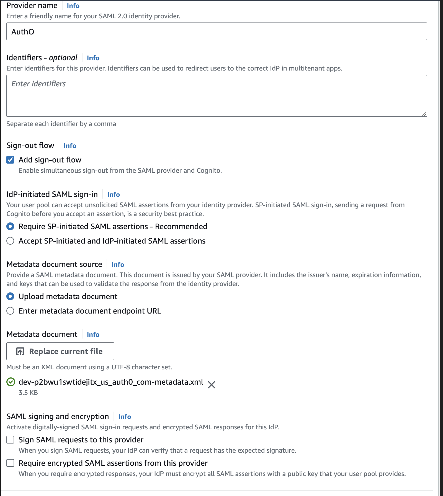
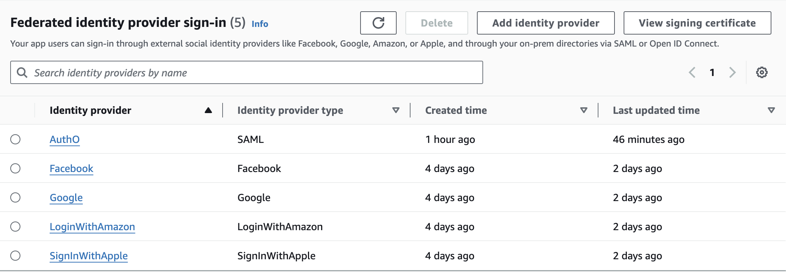
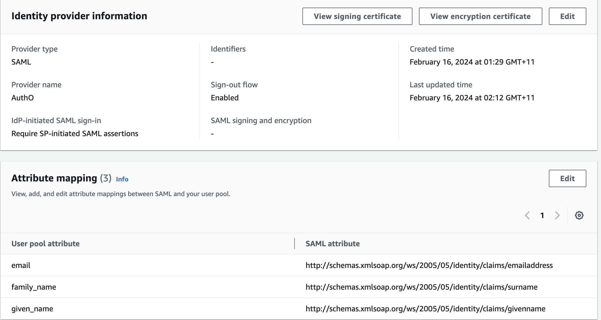
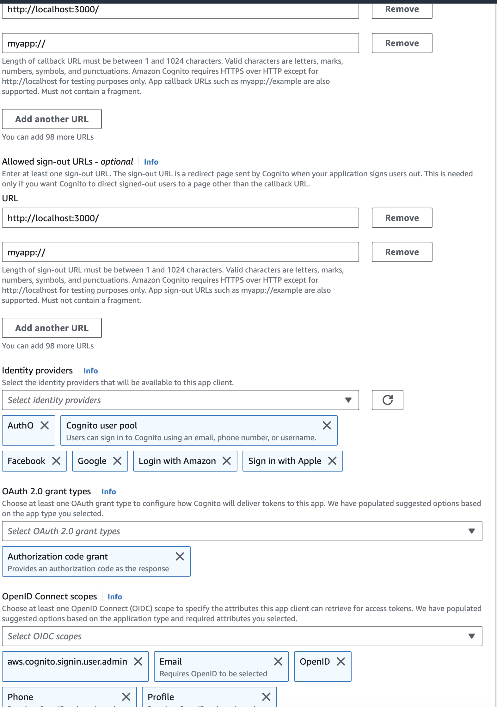

### Auth0 with SAML with AWS Amplify Cognito: SSO

This section covers implementation of Auth0 with SAML for our app. Auth0 with SAML SSO has been verified on Android, iOS, Web and macOS and is functional on all these platforms. 

This to keep an eye. In production, corporate deployments will be kept separate from public deployments. Hence, for corporate login, we will use SAML and SSO ONLY.

Whereas for public, we will use OAuth and keep that deployment separate. 

Hence, there will be no overlap on corporate and public user pools in real deployments.

For now, we are using all SSO options together for dev work.

-------------------------------------------------------------------------------------------------------------------

### Deployment 

1. [Auth0](https://auth0.com/)
2. AWS Cognito

Step 1: Go to Auth0 and setup a new application. Following links below on how to do this:

        https://www.youtube.com/watch?v=NVKUQctvpUE
        https://repost.aws/knowledge-center/auth0-saml-cognito-user-pool

Step 2: Settings.json file is attached. 

NOTE: In Settings.json, logout was added to remove "missing client.addons.samlp.logout.callback" error. And also, bindings were changed to  "urn:oasis:names:tc:SAML:2.0:bindings:HTTP-Redirect" so after logout user can be redirected back to app home page. 

OPEN ISSUE: Below is added to fix "missing client.addons.samlp.logout.callback". Error is fixed and web app does route back to localhost but it's not the app home page, instead an error page

     "logout": {
                "callback": "http://localhost:3000/",
                "slo_enabled": true
          }

Above issue is ONLY with web routing. Login, Logout works properly i.e. I can see users sign out and sign in in Auth0 but route does not work from Auth0. 

URI must be as below. See SAML2 being used instead of OAuth. 

        https://<your-cognito-domain>.auth.us-east-1.amazoncognito.com/saml2/idpresponse

STATUS: Issue is Parked as it works on all platforms except web, and even on web it does log out the user. We need to check in future on a real web deployment.

Get the metadata file as per tutorial and then go to AWS Cognito.

Step 3: Setup AWS Cognito as below

In AWS, Provider name MUST be 

        Auth0

And this MUST match exactly in the client as well, for example

        AuthProvider.saml(oAuthProviderName)
        where  oAuthProviderName = 'Auth0';

NOTE: We have used Lambda functions & we need to make changes in the pre-signup Lambda and post-auth Lambda to include Auth0.

Step 4: Setup AWS Amplify as below.

Step 5: You will see sample setup as below

Step 6: Map attributes to what we have set in Auth0 settings as below

Step 7: Add SAML provider in App Integration as below. We added it for both web and app clients i.e.

        <app_client_web>
        <app_client>

Hosted UI Web

Chat Client

Step 8: Sign In with Hosted Web UI. 

This will work but the redirect will not lead anywhere and you will see a result like below after sign in

        http://localhost:3000/?code=<REDACTED_AUTH_CODE>

Test usernames and passwords

        <redacted-test-email-1>  <REDACTED_PASSWORD>
        <redacted-test-email-2>  <REDACTED_PASSWORD>
        <redacted-test-email-3>  <REDACTED_PASSWORD>
        <redacted-test-email-4>  <REDACTED_PASSWORD>

-----------------------------------------------------------------------

### References

1. https://www.youtube.com/watch?v=NVKUQctvpUE
2. https://repost.aws/knowledge-center/auth0-saml-cognito-user-pool
3. https://docs.aws.amazon.com/cognito/latest/developerguide/cognito-user-pools-managing-saml-idp-naming.html
4. Auth0 Flutter : https://www.youtube.com/watch?v=JyxwtqlL3fI&list=PLCOnzDflrUceRLfHEkl-u2ipjsre6ZwjV&index=2

Troubleshooting

1. https://repost.aws/knowledge-center/cognito-invalid-saml-response-errors

------------------------------------------------------------------------

Appendix: All Settings

        {
        // "audience":  "urn:foo",
        // "recipient": "http://foo",
        // "mappings": {
        //   "user_id":     "http://schemas.xmlsoap.org/ws/2005/05/identity/claims/nameidentifier",
        //   "email":       "http://schemas.xmlsoap.org/ws/2005/05/identity/claims/emailaddress",
        //   "name":        "http://schemas.xmlsoap.org/ws/2005/05/identity/claims/name",
        //   "given_name":  "http://schemas.xmlsoap.org/ws/2005/05/identity/claims/givenname",
        //   "family_name": "http://schemas.xmlsoap.org/ws/2005/05/identity/claims/surname",
        //   "upn":         "http://schemas.xmlsoap.org/ws/2005/05/identity/claims/upn",
        //   "groups":      "http://schemas.xmlsoap.org/claims/Group"
        // },
        // "createUpnClaim":       true,
        // "passthroughClaimsWithNoMapping": true,
        // "mapUnknownClaimsAsIs": false,
        // "mapIdentities":        true,
        // "signatureAlgorithm":   "rsa-sha1",
        // "digestAlgorithm":      "sha1",
        // "destination":          "http://foo",
        // "lifetimeInSeconds":    3600,
        // "signResponse":         false,
        // "typedAttributes":      true,
        // "includeAttributeNameFormat":  true,
        // "nameIdentifierFormat": "urn:oasis:names:tc:SAML:1.1:nameid-format:unspecified",
        // "nameIdentifierProbes": [
        //   "http://schemas.xmlsoap.org/ws/2005/05/identity/claims/nameidentifier",
        //   "http://schemas.xmlsoap.org/ws/2005/05/identity/claims/emailaddress",
        //   "http://schemas.xmlsoap.org/ws/2005/05/identity/claims/name"
        // ],
        // "authnContextClassRef": "urn:oasis:names:tc:SAML:2.0:ac:classes:unspecified",
        // "logout": {
        //   "callback": "http://foo/logout",
        //   "slo_enabled": true
        // },
        // "binding": "urn:oasis:names:tc:SAML:2.0:bindings:HTTP-POST"
        }

------------------------------------------------------------------------